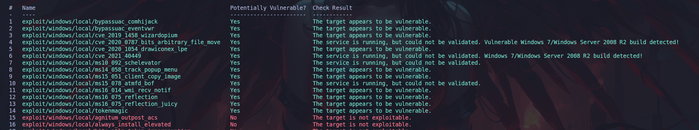

# 📈 Escalada de privilegios en Windows

## 

## 🔹 Enumeración del Sistema

```bash
systeminfo # Información detallada del sistema operativo y parches instalados.
wmic os get Caption, Version, BuildNumber # Versión del sistema operativo.
hostname # Nombre del host.
env # Variables de entorno.
```

## 🔹 Información de Usuario y Grupos

```bash
whoami # Identificar usuario actual.
whoami /priv # Privilegios del usuario actual.
whoami /groups # Grupos a los que pertenece el usuario.
net user # Lista de usuarios del sistema.
net localgroup Administradores # Usuarios con privilegios de administrador.
dir C:\Users # Directorios de usuarios.
history # Historial de comandos en PowerShell.
```

## 🔹 Información de Red

```bash
ipconfig /all # Muestra interfaces de red y configuración IP.
netstat -ano # Conexiones activas y puertos abiertos.
route print # Tabla de enrutamiento.
type C:\Windows\System32\drivers\etc\hosts # Configuración DNS.
arp -a # Tabla ARP.
sc query # ver los servicios existentes del sistema.
```

## 🔹 Buscar archivos.

```bash
find /s file # para buscar en el sistema con X nombre (user.txt | passwords.xml | *.txt).
findstr /si password *.<extensión> # .txt,xml,ini,etc.
dir /s /b /a "C:\Users\*pass*.txt" "C:\Users\*pass*.xml" "C:\Users\*pass*.ini"
```

## 🔹bash**Exploit Suggester** con Metasploit.

Una vez hayamos comprometido la máquina haremos lo siguiente:

```bash
msfconsole -q # Abrimos Metasploit en modo silencioso.
search local_exploit_suggeste # Busca el exploit.
use 0 # Seleccionamos el exploit, Este módulo analizará el sistema y proporcionará una lista de exploits recomendados basados en vulnerabilidades conocidas.
options # Vemos las opciones.
set SESSION 1 # Comprobamos nuestra sesión con sessions -l
run
```

Una vez que lancemos el exploit, nos saldrá una lista de posibles escalada de privilegios y tenemos que ir comprobando cual se ajusta a nuestras necesidades y nos funciona.

<figure><figcaption></figcaption></figure>

