# 👾 FindMe - TheHackersLabs

Una vez hayamos <mark style="color:purple;">**descargado, extraído y desplegado**</mark> nuestra máquina, vamos a proceder a realizar el primer <mark style="color:purple;">**escaneo/barrido**</mark> de nuestra red local para localizar nuestra máquina.

<mark style="color:yellow;">**`arp-scan -I eth0 --localnet --ignoredups`**</mark> > y esto nos reporta lo siguiente:

<mark style="color:yellow;">**`-I`**</mark> (eth0) Con este parámetro le indicamos nuestra interfaz de red.

<mark style="color:yellow;">**`--localnet`**</mark> le estamos indicamos que queremos analizar nuestra red local

<mark style="color:yellow;">**`--ignoredups`**</mark> le indicamos que no nos reporte por pantalla los posibles dispositivos duplicados.

<figure><figcaption>
Resultado del escaneo de nuestra red local.
</figcaption></figure>

En este caso nuestra máquina victima es la <mark style="color:yellow;">**`192.168.1.146`**</mark>

Ahora vamos a realizar un _ping_ con <mark style="color:yellow;">**`ping -c 2 192.168.1.146`**</mark> Para ver que la máquina está bien desplegada y tenemos conectividad con ella.

Y vemos que todo está bien.

<figure><figcaption>
Resultado del ping haía la máquina víctima.
</figcaption></figure>

<mark style="color:yellow;">**`TTL 64 = Linux`**</mark>

Ahora vamos a proceder al escaneo para comprobar que puertos están abiertos en dicha máquina con _<mark style="color:purple;">Nmap</mark>_

<mark style="color:blue;">**`nmap -p- --open --min-rate 5000 -sS -vvv -n -Pn 172.18.0.2 -oG allPorts`**</mark>

<mark style="color:blue;">**`-p-`**</mark> aplicar reconocimiento a todos los puertos\
<mark style="color:blue;">**`--open`**</mark> solo a los que estén abiertos\
<mark style="color:blue;">**`--min-rate 5000`**</mark> para enviar paquetes más rápido\
<mark style="color:blue;">**`-sS`**</mark> para descubrir puertos de manera silenciosa y rápida\
<mark style="color:blue;">**`-vvv`**</mark> conforme descubre un puerto nos lo muestra por pantalla\
<mark style="color:blue;">**`-n`**</mark> no aplica la resolución DNS (Para agilizar el escaneo)\
<mark style="color:blue;">**`-Pn`**</mark> ignora si esta activa o no la IP\
<mark style="color:blue;">**`-oG`**</mark> exportamos el resultado en formato grepeable (para después poder consultarlos si nos hiciera falta)

Y el escaneo nos devuelve lo siguiente:

_<mark style="color:yellow;">**Encontramos abiertos los puertos 21,22,80 y 8080.**</mark>_

<figure><figcaption>
Resultado escaneo con Nmap (21,22,80,8080).
</figcaption></figure>

Como podemos comprobar después del escaneo con <mark style="color:purple;">**Nmap**</mark>  encontramos abiertos los puertos:  <mark style="color:blue;">**21,22,80 y 8080**</mark>. Ahora vamos a proceder a realizar otro escaneo con _nmap_ para ver si nos puede arrojar mas información sobre los servicios y versiones que están corriendo para dichos puertos. Esto lo haremos con el siguiente comando:

<mark style="color:blue;">**`nmap -sCV -p21,22,80,8080 172.18.0.2`**</mark>&#x20;

Y nos arroja la siguiente información:

<figure>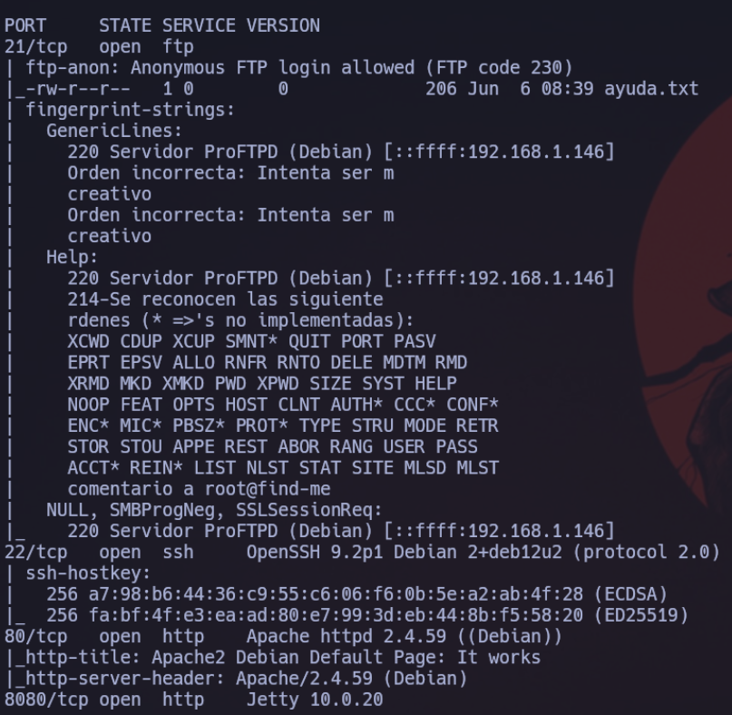<figcaption>
Resultado escaneo servicios y versiones de los puertos.
</figcaption></figure>

El escaneo nos reporta lo siguiente, podemos ver muchas cosas pero la que a nosotros nos interesa es que por el <mark style="color:purple;">puerto</mark> <mark style="color:purple;"></mark>_<mark style="color:purple;">21 FTP</mark>_ está habilitado el usuario _<mark style="color:purple;">anonymous</mark>_ <mark style="color:purple;"></mark><mark style="color:purple;">para poder entrar sin tener que proporcionarle contraseña.</mark> Asique antes de nada vamos a echar un ojo por ahí a ver que nos encontramos.

<mark style="color:yellow;">**`ftp 192.168.146`**</mark>

<figure><figcaption>
Asi podemos acceder al servicio FTP por el puerto 21
</figcaption></figure>

Una vez hayamos conseguido acceder al servicio <mark style="color:purple;">**FTP**</mark> vamos a utilizar el comando <mark style="color:purple;">**`ls`**</mark> para listar el contenido del directorio en el que nos encontramos y vemos un archivito con el nombre: <mark style="color:purple;">**ayuda.txt**</mark>

<figure>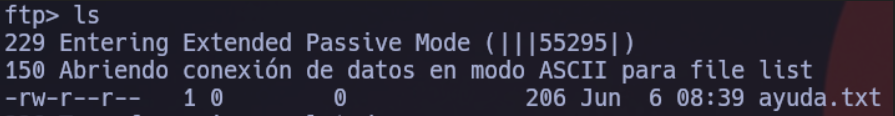<figcaption>
Resultado de listar el directorio actual.
</figcaption></figure>

Dentro del servicio <mark style="color:purple;">ftp</mark> no podemos listar el contenido del archivito ayuda.txt, asique lo que debemos hacer el traernoslo a nuestra máquina, y esto lo haremos con el comando: <mark style="color:purple;">**`get ayuda.txt.`**</mark>

Después de descargar el archivito ayuda.txt, vamos a <mark style="color:purple;">salir del servicio ftp</mark>, y cuando ya estemos en nuestra máquina atacante vamos a listar el contenido de dicho archivo con el comando: <mark style="color:purple;">**`cat ayuda.txt.`**</mark>

<figure>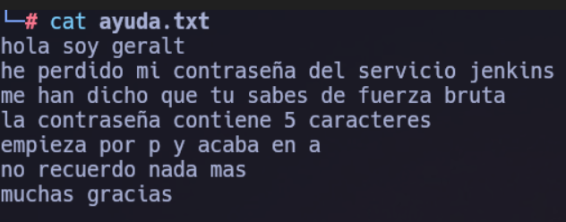<figcaption>
Contenido del archivo ayuda.txt
</figcaption></figure>

Aquí podemos descubrir un _usuario_ potencial Para el <mark style="color:purple;">**servicio**</mark><mark style="color:purple;">**&#x20;**</mark>_<mark style="color:purple;">**jenkins**</mark>_ que estará corriendo por alguno de los puertos que hemos encontrado abiertos, y otra cosa muy importante es que nos dice que <mark style="color:yellow;">**la contraseña de ese usuario tiene**</mark><mark style="color:yellow;">**&#x20;**</mark>_<mark style="color:yellow;">**5**</mark>_<mark style="color:yellow;">**&#x20;**</mark><mark style="color:yellow;">**caracteres, comienza con**</mark><mark style="color:yellow;">**&#x20;**</mark>_<mark style="color:yellow;">**p**</mark>_<mark style="color:yellow;">**&#x20;**</mark><mark style="color:yellow;">**y acaba en**</mark><mark style="color:yellow;">**&#x20;**</mark>_<mark style="color:yellow;">**a**</mark>_<mark style="color:yellow;">**&#x20;**</mark><mark style="color:yellow;">**sería algo como: p---a**</mark> , esto es una información muy valiosa. Asique ahora vamos a pasar a revisar la web que está corriendo por el puerto _80_ y a ver que nos encontramos.

<figure>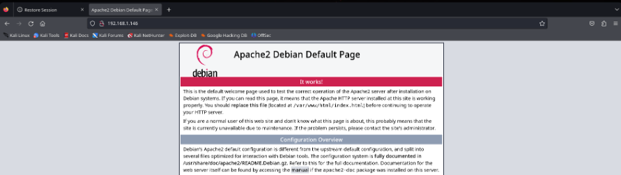<figcaption>
Contenido de la Web por el puerto 80.
</figcaption></figure>

Como vemos nos encontramos con la página por defecto de Apache.

Asique como anteriormente habíamos comprobado también que el puerto _<mark style="color:purple;">8080</mark>_ estaba abierto, vamos a acceder a ver que encontramos.

<figure>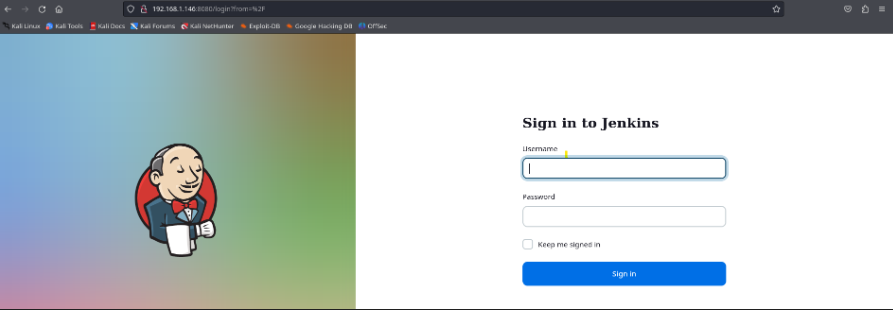<figcaption>
Descubrimos el servicio Jenkins corriendo por el puerto 8080.
</figcaption></figure>

Tras acceder al <mark style="color:purple;">puerto 8080</mark> podemos ver que por dicho puerto está corriendo el servicio <mark style="color:purple;">Jenkins.</mark>

_<mark style="color:yellow;">¿Qué es Jenkins?</mark>_

_<mark style="color:yellow;">Es una herramienta de código abierto, que se utiliza para compilar y probar proyectos de software de forma continua, lo que facilita a los desarrolladores integrar cambios en un proyecto y entregar nuevas versiones a los usuarios. Escrito en Java, es multiplataforma y accesible mediante interfaz web. Es el software más utilizado en la actualidad para este propósito.</mark>_

Una vez que hemos entrado aquí y vemos que hay un panel de _<mark style="color:purple;">login</mark>_ nos tenemos que acordar de que anteriormente descubrimos un usuario potencial llamado _<mark style="color:purple;">geralt</mark>_ y a su vez vimos que decía que se había olvidado de su _password_ pero que <mark style="color:purple;">**contenía 5 caracteres y empezaba con P y acababa con A**</mark> <mark style="color:purple;"></mark><mark style="color:purple;">.</mark>

Asique llegados a este punto tenemos claro que debemos realizar un _<mark style="color:purple;">ataque de fuerza bruta contra el panel de login</mark>_ Pero antes con todas las pistas que nos han dado vamos a utilizar la herramienta <mark style="color:yellow;">**`Crunch`**</mark> para crear nuestro propio diccionario con las pistas que nos habían proporcionado.

<mark style="color:blue;">**`crunch 5 5 -t p@@@a -o passwords.txt`**</mark>

<mark style="color:blue;">**`5`**</mark> Con el <mark style="color:purple;">primer número 5</mark> le indicamos el valor mínimo de caracteres que queremos que tenga cada palabra que nos genere.

<mark style="color:blue;">**`5`**</mark> Con el <mark style="color:purple;">segundo número 5</mark> le indicamos el valor máximo de caracteres que queremos que tenga cada palabra que nos genere.

<mark style="color:blue;">**`-t`**</mark> Especifica un juego de caracteres <mark style="color:purple;">personalizados</mark> que se utilizará.

<mark style="color:blue;">**`@`**</mark> Le decimos que <mark style="color:purple;">sustituya</mark> cada <mark style="color:purple;">@</mark> por un caractér aleatorio.

<mark style="color:blue;">**`-o`**</mark> Especifica el <mark style="color:purple;">archivo de salida</mark> donde se guardará la lista de palabras generada.

Una vez entendemos como funciona cada flag que le hemos introducido a la herramienta Crunch vamos a seguir.

<figure>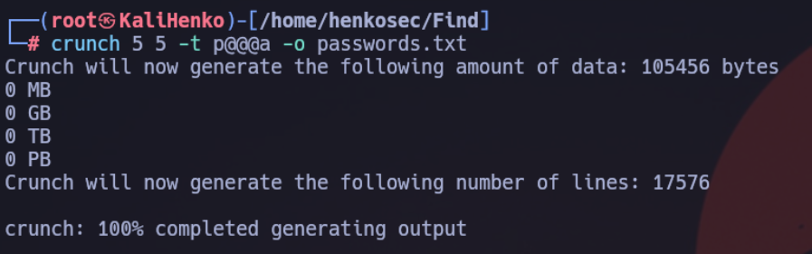<figcaption>
Ouput de la creación del wordlists con Crunch
</figcaption></figure>

Tras ejecutar la herramienta Crunch vemos que nos ha generado un diccionario con un total de <mark style="color:purple;">**17576 palabras.**</mark>

Antes de hacer el ataque de <mark style="color:purple;">fuerza bruta</mark>, debemos crear un archivito llamado: _<mark style="color:blue;">**user.txt**</mark>_<mark style="color:blue;">**&#x20;**</mark><mark style="color:blue;">**y almacenar en el el usuario**</mark><mark style="color:blue;">**&#x20;**</mark>_<mark style="color:blue;">**geralt.**</mark>_

_<mark style="color:purple;">Esto lo podemos hacer con el comando touch user.txt y después entrar en él y escribir el nombre de geralt y guardar y salir</mark>_

Y nos debería quedar algo así:

<figure>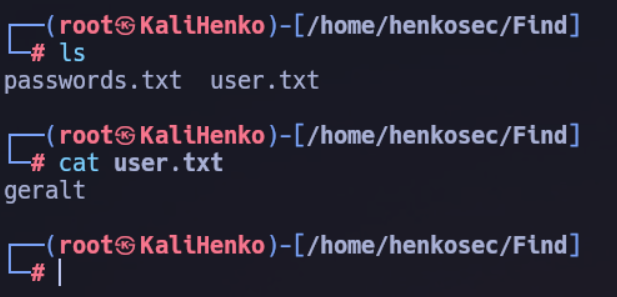<figcaption>
Todo listo para el ataque.
</figcaption></figure>

Y una vez tengamos esto ya podemos empezar con el _ataque_. Asique bien, ahora entra en juego una herramienta llamada: <mark style="color:purple;">**Patator**</mark> que es una herramienta super potente para realizar distintas herramientas, pero que en mi caso utilizaré para la fuerza bruta al panel de login.



Y el ataque lo haremos con el siguiente comando:

<mark style="color:blue;">**`patator http_fuzz method=POST url="http://192.168.1.149:8080/j_spring_security_check" body="j_username=FILE0&j_password=FILE1&from=%2F&Submit=" 0=user.txt 1=passwords.txt follow=1 accept_cookie=1 -x ignore:fgrep="Invalid username or password" --threads=10`**</mark>

Los parámetros utilizados para este comando como: _<mark style="color:purple;">j\_spring\_security\_check</mark>_

los conseguimos analizando la petición al intentar hacer login con cualquier usuario, _<mark style="color:blue;">lo podemos analizar en el navegador o tambien en bupsuite.</mark>_

Después de lanzar el ataque y esperar un poco nos a encontrado las credenciales:  <mark style="color:blue;">**`geralt:panda`**</mark>

<figure>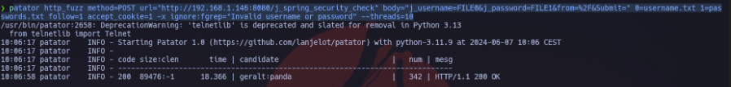<figcaption>
Resultado del ataque de fuerza brutal al login de jenkins
</figcaption></figure>

Una vez que hemos conseguido las credenciales para entrar, vamos a la Web y entramos como el usuario geralt y nos encontramos lo siguiente:

<figure>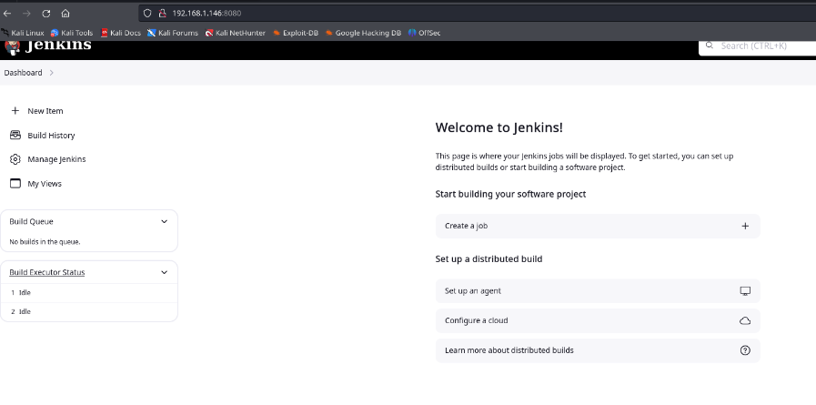<figcaption>
Página principal servicio Jenkins
</figcaption></figure>

Ahora vamos a intentar entablar una <mark style="color:purple;">reverse shell</mark>, y lo vamos a hacer de la siguiente manera: Nos vamos a:

_<mark style="color:blue;">**maange jenkins**</mark>_<mark style="color:blue;">**&#x20;**</mark><mark style="color:blue;">**>**</mark><mark style="color:blue;">**&#x20;**</mark>_<mark style="color:blue;">**script console**</mark>_

Ahora nos vamos a la conocida web de:&#x20;



Le indicamos nuestra _ip_ , el _puerto_ por el que vamos a ponernos a la escucha y seleccionamos el lenguaje: <mark style="color:yellow;">**`goovy`**</mark>. Y nos devolverá lo siguiente:

(debéis poner vuestra IP y el puerto que queráis)

<figure>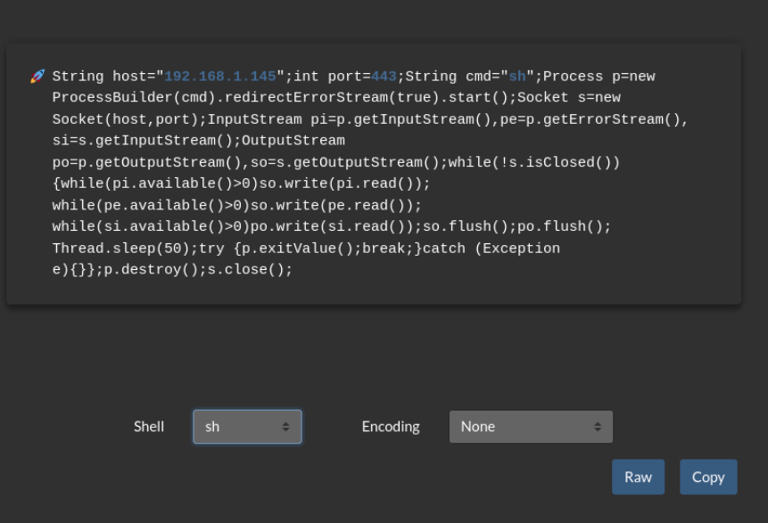<figcaption>
Configuración reverse shell.
</figcaption></figure>

Y ahora en el momento que pulsemos el botón de : <mark style="color:yellow;">**RUN**</mark> se nos entablará la reverse shell, asique antes que nada vamos a <mark style="color:purple;">ponernos a la escucha con</mark> <mark style="color:purple;"></mark>_<mark style="color:purple;">netcat</mark>_ <mark style="color:purple;"></mark><mark style="color:purple;">por el puerto que le hemos indicado en mi caso</mark> <mark style="color:purple;"></mark>_<mark style="color:purple;">443</mark>_ .

<mark style="color:blue;">**`sudo nc -nlvp 443`**</mark>

* <mark style="color:blue;">**`sudo`**</mark>: Este comando se utiliza para ejecutar Netcat con privilegios de superusuario.&#x20;
* <mark style="color:blue;">**`nc`**</mark>: Esta es la abreviatura de Netcat, la herramienta que se está utilizando.
* <mark style="color:blue;">**`-n`**</mark>: Esta opción le dice a Netcat que no intente resolver nombres de host mediante DNS, lo cual es útil para ahorrar tiempo y evitar potenciales problemas de resolución de nombres.
* <mark style="color:blue;">**`-l`**</mark>: Este parámetro pone a Netcat en modo escucha. En lugar de iniciar una conexión a un host remoto, Netcat esperará conexiones entrantes en el puerto especificado.
* <mark style="color:blue;">**`-v`**</mark>: Activa el modo verbose, lo que hace que Netcat proporcione información adicional sobre lo que está haciendo, como las conexiones que está estableciendo o cerrando.
* <mark style="color:blue;">**`-p 443`**</mark>: Este especifica el puerto en el cual Netcat estará escuchando. En este caso, es el puerto 443.

<figure>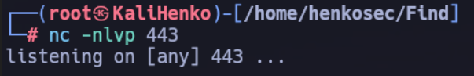<figcaption>
Nos ponemos a la escucha con Netcat
</figcaption></figure>

Una vez nos hayamos puesto a la escucha con Netcat nos volvemos a la Web y si recordais donde hemos escrito anteriormente el script para entablar la reverse shell, abajo a la derecha estba el botoncito: <mark style="color:blue;">**`RUN.`**</mark>

Asique ahora si le podemos pinchar.

Una vez que hemos conseguido entrar vemos que estamos dentro como el usuario _jenkins_ , hacemos un <mark style="color:blue;">**`ls`**</mark> y miramos ciertas cosas pero no vemos nada interesante,

vamos a intentar <mark style="color:purple;">migrar al usuario</mark> <mark style="color:purple;"></mark>_<mark style="color:purple;">geralt</mark>_ ya que previamente habíamos conseguido la contraseña:

<mark style="color:blue;">**`su geralt`**</mark>  y le proporcionamos la contraseña _<mark style="color:purple;">panda</mark>_

Ahora nos movemos al directorio de _geralt_ y con <mark style="color:blue;">**`ls`**</mark> vemos un <mark style="color:purple;">user.txt</mark> que contiene la _<mark style="color:blue;">**flag de user.**</mark>_

<figure>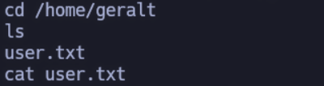<figcaption></figcaption></figure>

_<mark style="color:blue;">**Una vez hayamos conseguido esta flag de user la podemos copiar y almacenarla en un archivito para mas tarde cuando consigamos la de root poder entrar en el web de la plataforma y proporcionarlas.**</mark>_

Ahora como somos el usuario _<mark style="color:blue;">**geralt**</mark>_ vamos a intentar la <mark style="color:yellow;">**escalada de privilegios.**</mark>

Para la escala de privilegios vamos a probar a utilizar el siguiente comando:

<mark style="color:blue;">**`find / -perm -4000 2>/dev/null`**</mark>

* <mark style="color:blue;">**`find`**</mark> es un comando  utilizado para buscar archivos y directorios en un árbol de directorios.
* <mark style="color:blue;">**`/`**</mark> especifica el directorio raíz del sistema de archivos, lo que significa que la búsqueda se realizará en todo el sistema.
* <mark style="color:blue;">**`-perm`**</mark> es una opción de `find` que permite buscar archivos según sus permisos.
* <mark style="color:blue;">**`-4000`**</mark> especifica que estamos buscando archivos  SUID (Set User ID) activado. El  SUID permite que un archivo se ejecute con los privilegios del propietario del archivo, en lugar del usuario que lo ejecuta. Esto es importante porque los archivos con el SUID pueden ser utilizados para escalar privilegios si no están configurados correctamente.
* <mark style="color:blue;">**`2>`**</mark> redirige el flujo de error estándar (stderr).
* <mark style="color:blue;">**`/dev/null`**</mark> es un dispositivo especial que descarta cualquier dato que se le envíe. En este contexto, se utiliza para silenciar los mensajes de error que podrían generarse debido a la falta de permisos para acceder a ciertos directorios o archivos durante la búsqueda.

Y esto nos reportará lo siguiente:

<figure>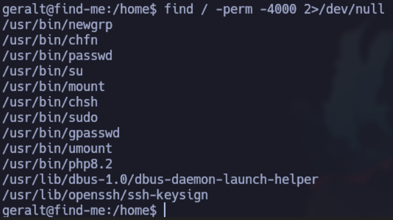<figcaption>
Resultado de la busqueda de archivos con permisos SUID
</figcaption></figure>

Vemos que tenemos el <mark style="color:blue;">**binario**</mark><mark style="color:blue;">**&#x20;**</mark>_<mark style="color:blue;">**php8.2**</mark>_ que tiene permisos _SUID_ , por lo que vamos a ir a la página _gtfobins_ y buscar a ver que podemos hacer para conseguir el abuso de ese binario.



Y nos reporta lo siguiente.

<figure><figcaption></figcaption></figure>

y vemos que si ejecutamos:

<mark style="color:blue;">**`CMD="/bin/sh" y despues: /usr/bin/php8.2 -r "pcntl_exec('/bin/sh', ['-p']);"`**</mark>

somos el usuario _root_ , nos movemos a su directorio <mark style="color:blue;">**`cd /root`**</mark> y con <mark style="color:blue;">**`ls`**</mark> vemos el archivito _<mark style="color:blue;">root.txt</mark>_ y si le hacemos un <mark style="color:blue;">**`cat`**</mark> vemos la flag de root.

Espero que os haya servido de ayuda, os dejo por aquí abajo el WriteUp de la máquina tambien en video.


Resolución máquina.



Link a mi perfil de instagram.

